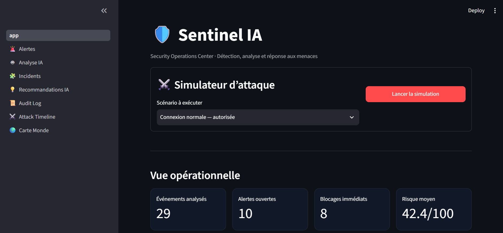
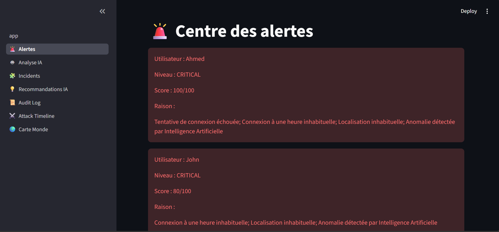
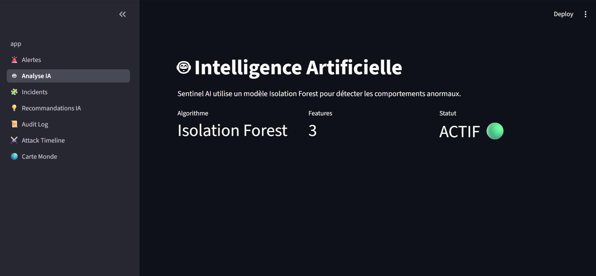
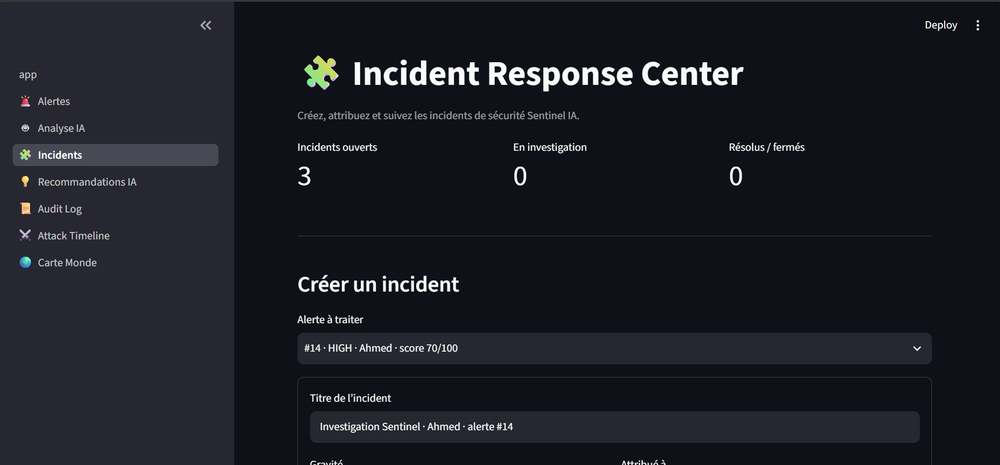
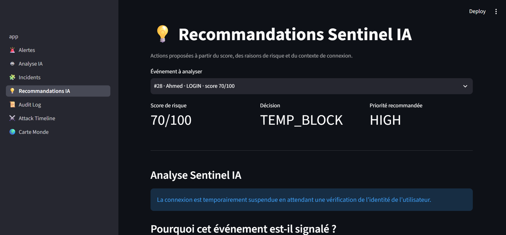
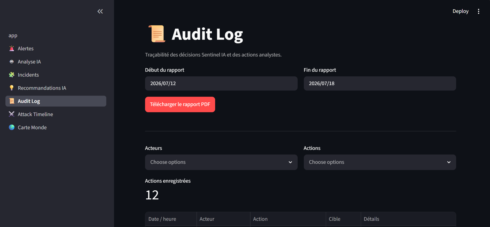
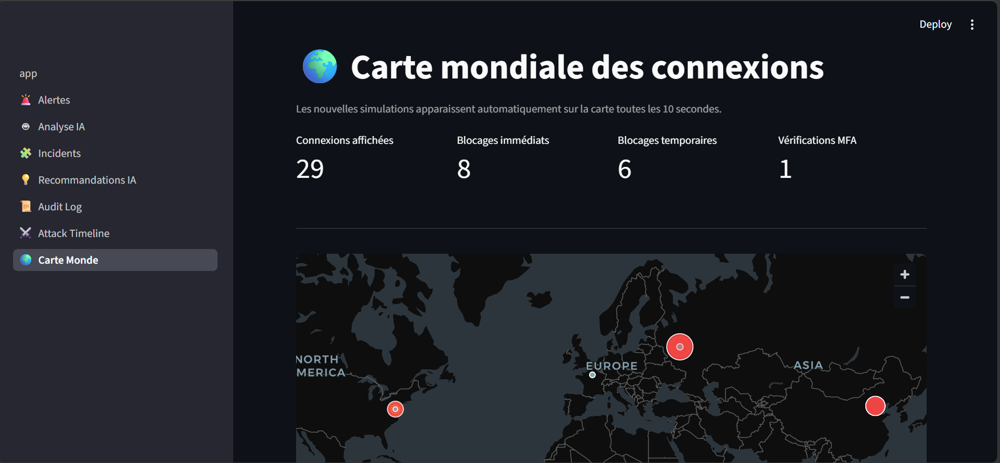

# 🛡️ Sentinel IA

# 🛡️ Sentinel IA

## Système intelligent de cybersécurité basé sur l'intelligence artificielle

Sentinel IA est une plateforme de cybersécurité intelligente conçue pour détecter, analyser et répondre aux menaces informatiques en temps réel.

Le système combine :
- une détection automatique des événements de sécurité ;
- une analyse par intelligence artificielle ;
- un moteur de décision basé sur un score de risque ;
- une assistance aux analystes de sécurité ;
- une traçabilité complète des incidents.

---

#  Fonctionnalités principales

##  Sentinel IA Decision Engine

Le moteur IA analyse chaque événement et attribue un score de risque selon plusieurs critères.

Selon le niveau de menace, Sentinel IA peut recommander :

-  Blocage immédiat
-  Blocage temporaire
-  Demande d'informations supplémentaires
-  Autorisation de l'action

La décision finale reste contrôlée par l'analyste humain.

---

##  Gestion des alertes

Surveillance des événements suspects avec création automatique d'alertes.

Fonctionnalités :
- détection des anomalies ;
- classification des risques ;
- historique des alertes.

---

##  Analyse des incidents

Les analystes peuvent étudier les incidents détectés :

- origine de l'attaque ;
- événements associés ;
- historique ;
- actions effectuées.

---

##  Carte mondiale des attaques

Visualisation géographique permettant d'observer :

- provenance des attaques ;
- localisation des menaces ;
- évolution des événements.

---

##  Audit Logs

Système complet de journalisation :

- actions utilisateurs ;
- décisions IA ;
- événements de sécurité ;
- historique des opérations.

---

#  Interface du système

## Dashboard

## Alertes

## Analyse IA

## Incidents

## Recommandations IA

## Audit Logs

## Carte mondiale

---

#  Architecture du projet

---

#  Technologies utilisées

- Python
- Intelligence artificielle
- Machine Learning
- Base de données SQLite
- Streamlit
- Analyse d'événements
- Cybersécurité

---

#  Objectif

Créer un système intelligent capable d'assister les équipes de cybersécurité dans la détection, l'analyse et la réponse aux cyberattaques.
